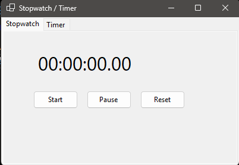
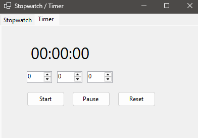

# Timer
---
- Приложение для работы с секундомером и таймером
---
- An application for working with a stopwatch and timer
---
### Stopwatch
- Старт / Пауза / Сброс
- Отображение времени в формате **чч:мм:сс:мс**  
---
### Stopwatch
- Start/ Pause / Reset
- Time display in **hh:mm format:ss:ms**
---
### Timer
- Установка часов, минут и секунд
- Старт / Пауза / Сброс
- Звуковое уведомление по окончании  
---
### Timer
- Setting hours, minutes and seconds
- Start/ Pause / Reset
- Audio notification at the end
---
## Запуск проекта:
- Клонировать репозиторий
- Открыть проект в Visual Studio
- Собрать и запустить проект
---
## Project launch:
- Clone the repository
- Open the project in Visual Studio
- Build and launch a project
---

## Скриншот
  

  

---